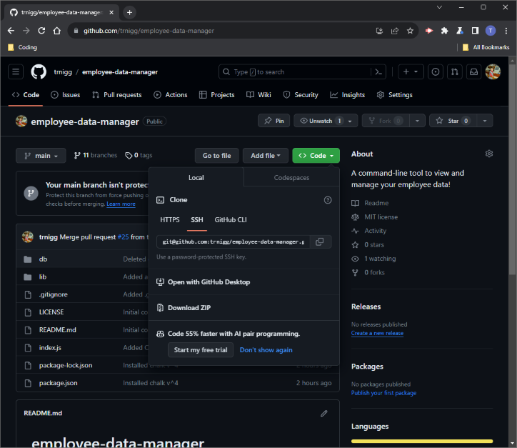
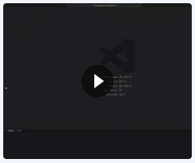

# Employee Data Manager
(`employee-data-manager` - Module 12 Challenge: Employee Tracker)  

A command-line tool to view and manage your employee data!

## Description
- This application allows you view and modify (insert, update and delete) the employee data in your database via the command line.
- It is written in JS using the [`Node.js`](https://nodejs.org/en) runtime environment, leveraging [`Inquirer v^8.2.4`](https://www.npmjs.com/package/inquirer/v/8.2.4) for command-line interactivity and [`MySQL2 v^3.6.3`](https://www.npmjs.com/package/mysql2/v/3.6.3) for connecting and communicating with the `MySQL` database.
    - (For a full list of dependencies, please see [`package.json`](./package.json)  in the repo.)

## Table of Contents
- [Installation](#installation)
- [Usage](#usage)
    - [Usage Guide](#usage-guide)
    - [Walkthrough Video](#walkthrough-video)
- [Tests](#tests)
- [Roadmap / Known Bugs](#roadmap--known-bugs)
    - [UI Features](#ui-features)
    - [Code Base](#code-base)
- [License](#license)
- [Questions](#questions)

## Installation
**Before installing the application**, please ensure you have installed [`Node.js`](https://nodejs.org/en) and `npm`.  
Additional, the [`MySQL Shell`](https://dev.mysql.com/doc/mysql-shell/8.0/en/mysql-shell-install.html) is required for initialisation of the database as described below (**Step 5**). 

To install the application: 
1. Visit the [employee-data-manager](https://github.com/trnigg/employee-data-manager) repo on GitHub.
2. Download and extract the `.zip` of the repository to your desired directory:  

3. Navigate to the directory using the console, or open it in an integrated terminal.
4. Enter `npm i` or `npm install` in your console or integrated terminal to retrieve and install the required dependencies and automatically create a folder to store these (`./node_modules`).
5. Initialise the database using the MySQL Shell:
    - Navigate to the directory containing `schema.sql` using the console, or open it in an integrated terminal.
    - In the console, enter `$ mysql -u root -p`, then when prompted enter your `MySQL` password.
    - Finally, initialise the database by entering `source schema.sql;` .
    - (Optional:) If you would like to seed the database with some sample test-data, enter `source seeds.sql;` .

## Usage

### Usage Guide
To use the application: 
1. While in the directory it is stored in (see [Installation](#installation) above), enter `node index.js` in the console to run the application.
2. You will be asked if you would like to connect to the **Employee Database Management System**. Enter `y` to confirm and continue.
3. The main menu will then appear - select what you would like to do. A number of items contain a sub-menu/additional options. All sub-menus include an option to `RETURN` to the main menu. The following represents the menu-tree and functions available to you:

```
├── View all departments
├── Manage department
│   ├── Add a department
│   ├── Delete a department
│   └── View utilised budget of a department
├── View all roles
├── Manage role
│   ├── Add a role
│   └── Delete a role
├── View employees
│   ├── View all employees
│   ├── View employees by manager
│   └── View employees by department
├── Manage employee
│   ├── Add an employee
│   ├── Update employee's role
│   ├── Update employee's manager
│   └── Delete an employee
└── EXIT
```

4. After selecting an option and answering some additional prompts if required, you will be shown a table containing data you requested, or a message confirming your actions. You will then be returned to the main menu.
5. Select `EXIT` from the menu once you are done, or if you need to quit mid prompt-sequence, press `ctrl + c` on Windows or `⌘ + c` on Mac. You can reconnect again by using the method in **Step 1**.

The prompts have been designed to make usage as intuitive as possible. For a more in-depth example of usage, please see the walkthrough video of the usage process below:

### Walkthrough Video
Please click on the thumbnail below for a comprehensive demo of the [installation](#installation) and [usage](#usage):  

[](https://drive.google.com/file/d/1D_XdHCxqK9DSs8MgL8a7W81uSiwswG1t/view)

## Tests
- The current build of this application does not include any tests.

## Roadmap / Known Bugs
The following is a non-exhaustive list of items I would like to address with more development time in the future:
### UI Features
- Feature allowing 'backwards navigation' through the prompts, in case the user makes a mistake and wishes to go back to change their answer. Currently only sub-menus include a `RETURN` option.
- Additional prompts asking for confirmation would be desirable - at the moment, it is quit easy to accidently delete a department/role/employee from the database without a warning message or confirmation of action.
- UI could be made more appealing generally, with indentation of menu options, and more visually appealing representation of data and messages.


### Code Base
- While the code was written with modularisation in mind, due to time constraints in development, some parts of the code don't always represent this and don't fully separate concerns.
    - For example, `queries.js` containing the `Queries` class could easily be improved with the use of child-classes the group together relevant queries.


## License
- This project is licensed under the [MIT License](https://choosealicense.com/licenses/mit).
- Please refer to the [license](./LICENSE) section in the repo for further information.

## Questions
- For any questions, issues or feedback, please reach out to me on GitHub at [trnigg](https://github.com/trnigg/).